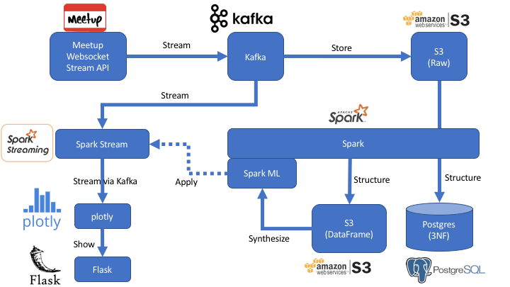

# meetup-rsvps

Study meetup RSVP stream data

## Data Source

Meetup RSVP stream API:

`http://stream.meetup.com/2/rsvps`  
`http://stream.meetup.com/2/photos`  
`http://stream.meetup.com/2/event_comments`  

[DocRef](https://secure.meetup.com/meetup_api/docs/stream/2/rsvps/#websockets)

## System Architecture Overview



### Stream
* __Kafka Websocket Producer__: recieve from Meetup Websocket Stream API, pipe to Kafka
* __Kafka Instance__: running in EC2
* __Kafka Spark Consumer__: receive from Kafka, pipe to Spark Stream for real-time analysis, then pipe dashboard data to Flask/Plotly

### Store
* __Kafka S3 Consumer__: receive from Kafka, store raw data in S3 for batch analysis

### Structure
* __Spark__: perform ETL to persist to PostgreSQL and DataFrame paquet in S3 >>> 3NF
* __PostgreSQL__: RDBMS version of structured ETL data
* __S3__: parquet-ed Spark DataFrame version of structured ETL data

### Synthesize
* __Spark ML__: 
	* load DataFrame from S3
	* perform Machine Learning tasks
	* persist model in S3 (to be loaded in Spark Stream)

### Show
* __Flask__: python web server to serve dynamic page
* __Plotly__: real-time charts to show metrics and predictions

## Detail Description

### Stream

#### Websocket Poller Sample Code

```python
#!/usr/bin/env python3
import websocket
import _thread
import time

def on_message(ws, message):
    print (message)

def on_error(ws, error):
    print (error)

def on_close(ws):
    print ("### closed ###")

def on_open(ws):
    def run(*args):
        while True:
            time.sleep(1)
            # ws.send("Hello %d" % i)
        ws.close()
        print ("thread terminating...")
    _thread.start_new_thread(run, ())


if __name__ == "__main__":
    websocket.enableTrace(True)
    ws = websocket.WebSocketApp("ws://stream.meetup.com/2/rsvps",
                                on_message = on_message,
                                on_error = on_error,
                                on_close = on_close)
    ws.on_open = on_open

    ws.run_forever()
```

### Structure
Both Parquet-ed S3 DataFrame and RDBMS PostgreSQL persisted data shall conform with 3rd Normal Form (3NF).

The ER diagram as below.


### Synthesize

* General metrics:
	* E.g. Count RSVP per region
* Derived metrics:
	* E.g. Study what category of meetup is popular
* Predicted metrics:
	* E.g. Predict RSVP Yes/No based on other attributes

### Show
* Flask to render dynamic page
* Plotly to show real-time charts

## Stories
### Use Case Scenarios TBA
...

## Future
### Architecture
* Build full-fledged Lambda architecture to "merge" the real-time and batch query result, show in Web HMI

### Stream
* Distributed Kafka setup

### Synthesize
* More machine learning tasks

### Show
* Query Interface